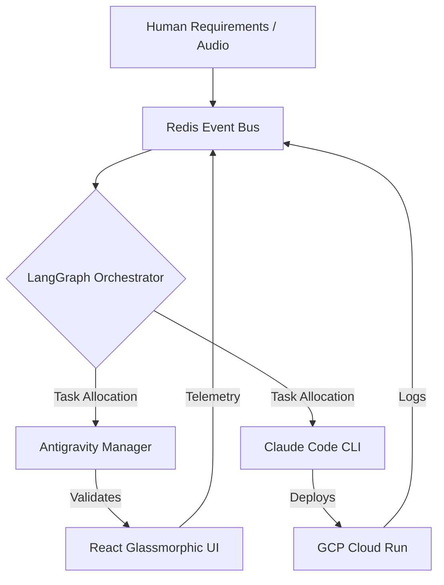

# ORCHESTRATION MANUAL: Sifu 5.2 NHITL Factory
**Project:** Concentrix Agentic Transformation Hub
**Architect:** Sifu (Shadow Architect)
**Governance:** Dual-Key Architecture (Antigravity Manager + Claude Code CLI)

---

## 1. Executive Summary: The NHITL Paradigm
The **Autonomous Software Factory (NHITL - No-Human-In-The-Loop)** is a cutting-edge engineering framework designed to convert real-time requirements (audio/text) into production-ready software without manual intervention in the execution loop. 

### **Business Value Proposition**
*   **ROI (Return on Investment):** Drastic reduction in operational costs by automating the 80% of repetitive software engineering tasks (scaffolding, testing, deployment).
*   **TTM (Time-to-Market):** Transition from a 2-week sprint cycle to a **40-minute deployment window** for new conversational features.
*   **Operational Resilience:** High availability through a self-healing monitor that detects and repairs desynchronization in the event bus.

---

## 2. Technical Core: Event-Driven Architecture (EDA)
Our system operates on a decoupled **EDA** topology, ensuring that reasoning and execution are isolated for maximum reliability.

---

## 3. Governance: The Dual-Key Model
To prevent "Vibecoding Dissonance" and ensure code quality, we implement a strict separation of powers:

*   **Antigravity Manager (The Brain):** Senior Tech Lead and Architect. Responsible for the `spec.md`, `plan.md`, and `SYNC_CONTRACT.md`. It validates the UI and ensures design consistency.
*   **Claude Code CLI (The Muscle):** Lead Backend & DevOps Engineer. Executes infrastructure tasks, manages the monorepo, and deploys containers to GCP. 
*   **Sifu (The Eye):** Shadow Architect. Provides non-invasive observability, ADR (Architecture Decision Record) documentation in Notion, and real-time auditing.

## 4. Capacidades Avanzadas (La Singularidad de Sifu)

### **A. Auto-Programación (Meta-Graph Engine)**
Nuestra factoría tiene la capacidad de **auto-reproducirse**. Si un requerimiento supera la lógica actual, el `Meta-Graph Engine` arquitacta y programa un nuevo flujo de LangGraph en Python de forma autónoma, integrándolo al sistema en segundos.

### **B. Auto-Sanación de Código (Self-Healing Coder)**
A diferencia de los LLMs tradicionales que pueden entregar código roto, nuestro sistema utiliza un **bucle de auto-corrección físico**:
1. El `ZTA Validator` ejecuta un build real del código generado.
2. Si el build falla, el `Self-Healing Coder` analiza los logs de error de la terminal.
3. El agente genera un fix quirúrgico y lo re-inyecta hasta que la compilación es exitosa.

---

## 5. Architectural Pillars (Sifu 5.2 Refinement)

### **A. Infrastructure: Pure GCP Serverless**
We transitioned from third-party hosting (Firebase) to a **100% Native GCP** stack:
*   **Compute:** Google Cloud Run (Scaling to zero, WebSocket support).
*   **Registry:** Artifact Registry for immutable container versioning.
*   **DevOps:** GitHub Actions with native caching for Turborepo and pnpm.

### **B. State Management: Zustand & Transient Updates**
To handle high-frequency event streams (60Hz) from the AI factory without freezing the UI:
*   **Partitioned Stores:** `useBusinessStore` (Strategic data) vs `useCanvasStore` (Live traces).
*   **Transient Updates:** Direct DOM mutation via WebSocket references, bypassing React's main render loop for the Live Canvas.

### **C. UI Philosophy: Glassmorphic Dark-Native**
Designed for modern Enterprise Operations Centers. A "Refreshingly Simple" interface that prioritizes readability and high-impact visual KPIs.

---

## 5. Security: ZTA & Kill-Switch
*   **ZTA (Zero Trust Architecture):** Every piece of code generated by Claude Code is intercepted by the **Guardrails Auditor** before deployment.
*   **The Kill-Switch:** Agents are limited to **3 autonomous retry iterations**. If a conflict persists, the system blocks execution and escalates to the Enterprise Architecture Board (Eduard & Gemini).

---
*Generated by Sifu on 2026-03-27 for the Concentrix Technical Interview.*
