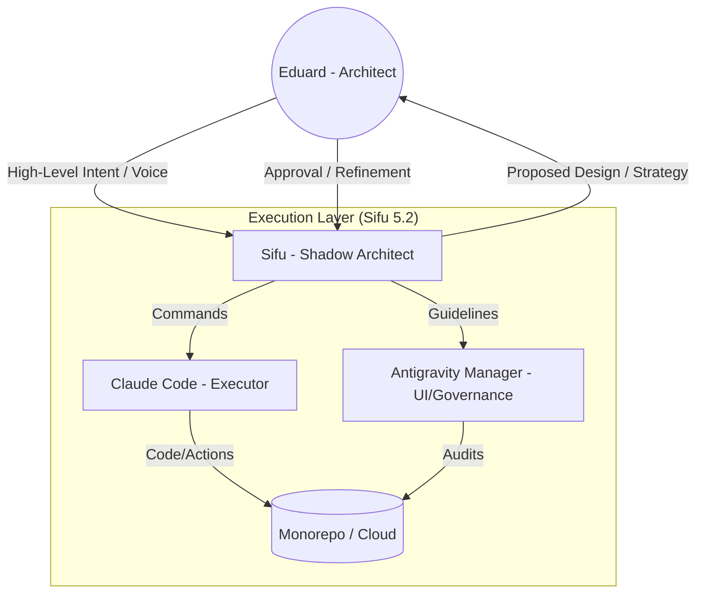
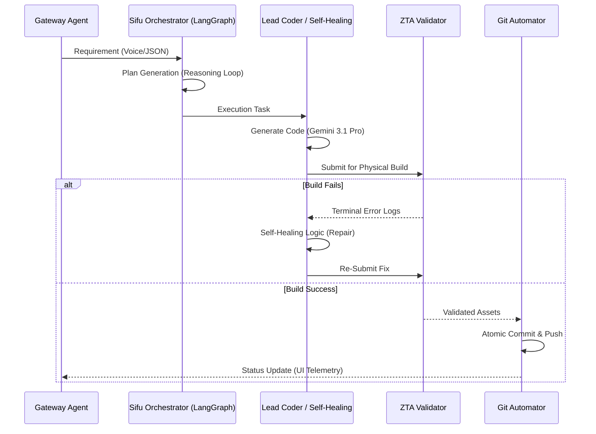
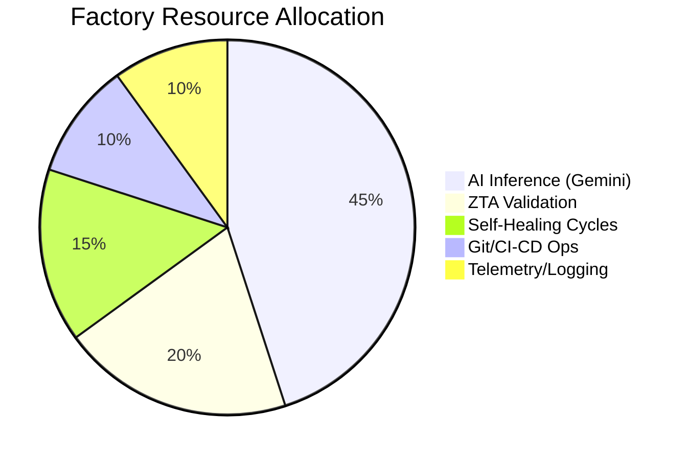

# Visual Strategy: Sifu 5.2 Architecture & Flows

## 1. Governance & Interaction Model (Eduard + Sifu)
This diagram explains the "Dual-Key" system where Eduard (Architect) and Sifu (Shadow Architect/Executor) interact to ensure high-fidelity outputs.

## 2. Agentic Workflow (AutoGen/LangGraph)
How our 12 agents collaborate using an Event-Driven Architecture (EDA) via Redis.

## 3. Anti-Hallucination & Guardrail Controls
How we ensure 100% deterministic and safe outputs for Enterprise CCaaS.

| Control Layer | Mechanism | Purpose |
| :--- | :--- | :--- |
| **Semantic Firewall** | Vector DB / RAG | Restricts response to verified "Source of Truth" documents only. |
| **Deteriminstic Output** | Pydantic / Zod Schemas | Forces the LLM to output valid JSON that matches the system's expected types. |
| **Physical Build (ZTA)** | Terminal Execution | Never trust code without a successful `npm build` or `python test`. |
| **GRC Auditor** | PII Scrubber | Automatically masks or blocks any PII/PCI data before it leaves the secure zone. |
| **Meta-Graph Validation** | Self-Correction | Every agent output is reviewed by a second "Auditor" agent before execution. |

## 4. Monitoring & Telemetry HUD
Real-time metrics sent from the factory to the Glassmorphic Dashboard.

