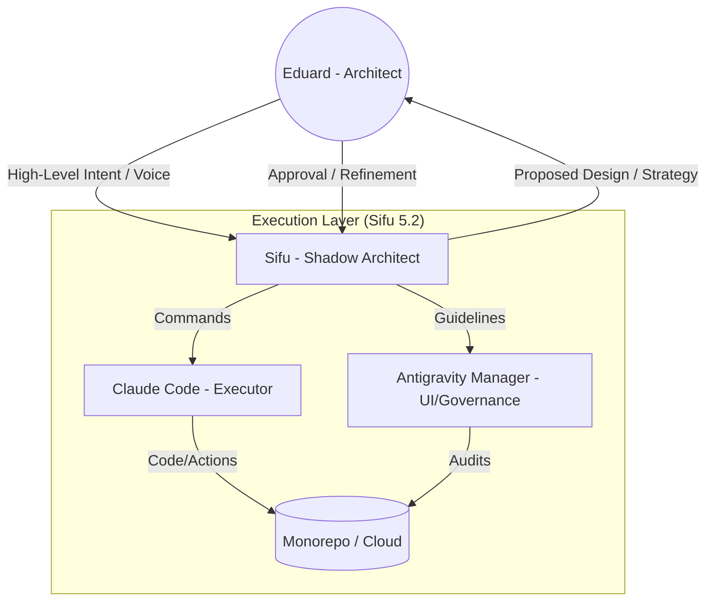
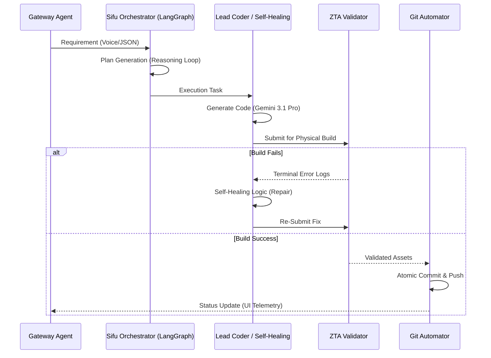

# Visual Strategy: Sifu 5.2 Architecture & Flows

## 1. Governance & Interaction Model (Eduard + Sifu)
This diagram explains the "Dual-Key" system where Eduard (Architect) and Sifu (Shadow Architect/Executor) interact to ensure high-fidelity outputs.

## 2. Agentic Workflow (AutoGen/LangGraph)
How our 12 agents collaborate using an Event-Driven Architecture (EDA) via Redis.

## 3. Anti-Hallucination & Guardrail Controls
How we ensure 100% deterministic and safe outputs for Enterprise CCaaS.

| Control Layer | Mechanism | Purpose |
| :--- | :--- | :--- |
| **Semantic Firewall** | Vector DB / RAG | Restricts response to verified "Source of Truth" documents only. |
| **Deteriminstic Output** | Pydantic / Zod Schemas | Forces the LLM to output valid JSON that matches the system's expected types. |
| **Physical Build (ZTA)** | Terminal Execution | Never trust code without a successful `npm build` or `python test`. |
| **GRC Auditor** | PII Scrubber | Automatically masks or blocks any PII/PCI data before it leaves the secure zone. |
| **Meta-Graph Validation** | Self-Correction | Every agent output is reviewed by a second "Auditor" agent before execution. |

## 4. Estrategia de Controles Anti-Alucinaciones (The Sifu Shield)
Para entornos de **Misión Crítica** (Concentrix), las alucinaciones no son una opción. Nuestra arquitectura implementa 4 capas de blindaje:

1.  **Semantic Firewall (RAG Verification):** El modelo no responde por "intuición". Antes de generar una respuesta, consulta nuestra base de conocimientos vectorizada. Si la información no está en los documentos oficiales, el agente declara: "No tengo esa información en mi fuente de verdad".
2.  **Deterministic Schemas (Zod/Pydantic):** Forzamos a la IA a responder en formatos JSON estrictos. Si el modelo intenta "inventar" un campo, el validador lo rechaza instantáneamente, obligando al modelo a corregirse.
3.  **Physical Build Validation (ZTA):** No confiamos en el código que la IA "dice" que funciona. Cada script generado pasa por un `pnpm build` real en un entorno aislado. Si falla, el **Self-Healing Coder** lo repara basándose en los logs de la terminal, no en suposiciones.
4.  **Audit-Loop (Reflection):** Cada decisión de un agente es revisada por un segundo agente "Auditor" con un System Prompt enfocado exclusivamente en encontrar errores de lógica o riesgos de seguridad (PII/PCI).

## 5. Gráficas de Monitoreo & Telemetría (HUD)
Nuestra UI Glassmorphic no es cosmética; es una ventana en tiempo real al bus de eventos de Redis.

*   **Latencia de Inferencia:** Monitoreamos los ms que tarda Gemini en "pensar".
*   **Tasa de Éxito ZTA:** Porcentaje de código generado que pasa la compilación al primer intento.
*   **Deflección de Errores:** Cantidad de alucinaciones o errores de seguridad bloqueados por el Firewall Semántico.
