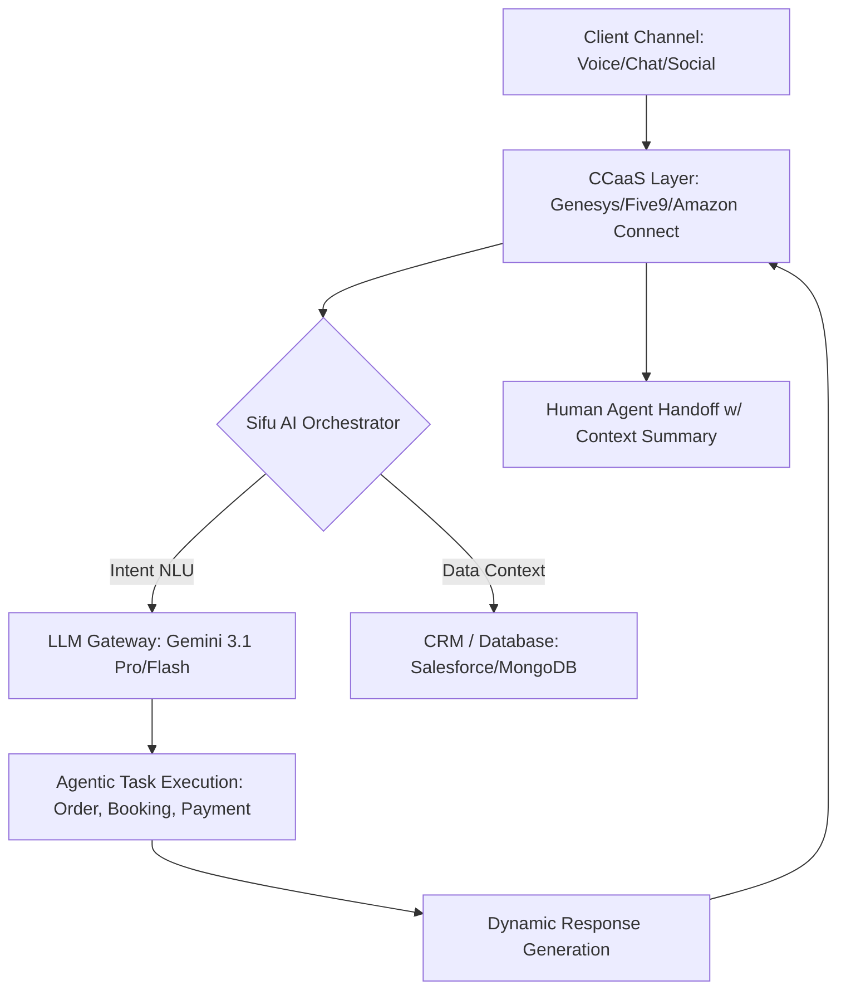
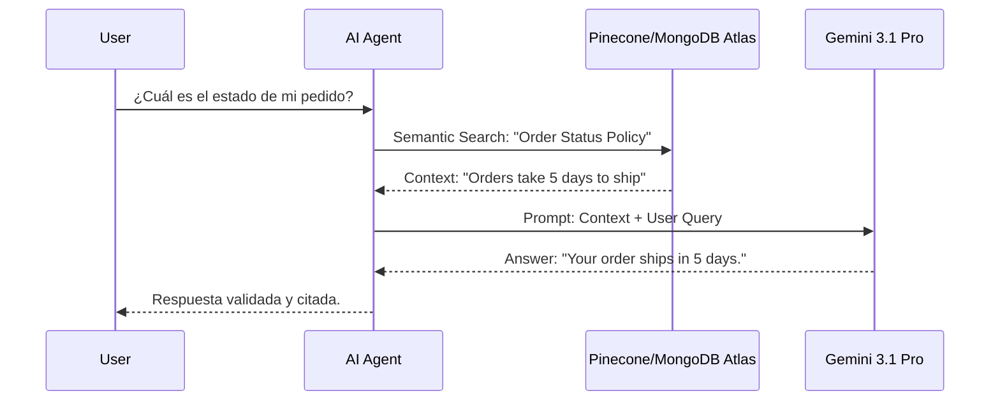
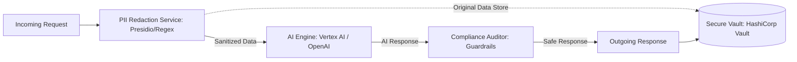

# ARCHITECTURE DIAGRAMS (MERMAID.JS) - PRE-MADE FOR INTERVIEW

Eduard, si te piden un diagrama en vivo, aquí tienes 3 que puedes copiar y pegar en cualquier editor (como el de [Mermaid.live](https://mermaid.live/)) para impresionar gráficamente.

---

## 1. OMNICHANNEL AI FLOW (OMNI-UX)
*Ideal para explicar cómo el bot gestiona voz, chat y mensajería.*

---

## 2. RAG PIPELINE (KNOWLEDGE-DRIVEN AI)
*Ideal para explicar cómo evitas las alucinaciones del LLM.*

---

## 3. SECURITY & PII SANITIZATION LAYER (GRC)
*Ideal para mostrar tu nivel de Arquitecto Senior y Seguridad.*

---

## CONSEJO DE SIFU (MODO ARQUITECTO):
- **Copia el código Mermaid** y tenlo a mano en un Note. 
- Si te piden explicar la arquitectura, pégalo en un visualizador o simplemente explica los nodos: "Como vemos en mi diseño, la capa de orquestación centraliza la lógica de negocio y separa el LLM de los datos sensibles."

---
*Created by Sifu (Shadow Architect) for Concentrix Interview.*
