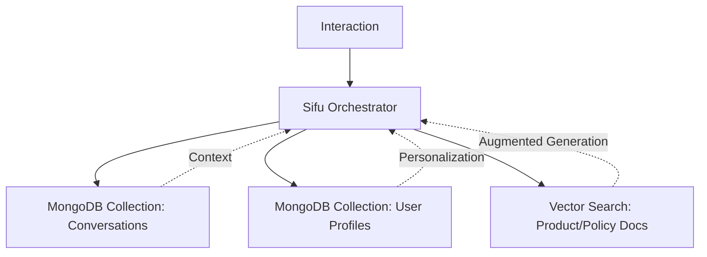

# MONGODB & VECTOR SEARCH ARCHITECTURE (CONCENTRIX 4.0)
**Candidate:** Eduard | **Role:** Principal AI Solution Architect
**Objective:** Address the "Bonus Skills" (MongoDB) from the JD with a focus on Agentic AI.

Eduard, el JD menciona MongoDB como una habilidad deseada. He diseñado esta arquitectura para que muestres cómo usarías MongoDB no solo como base de datos, sino como el **Cerebro de Memoria Semántica** de tu orquestador de IA.

---

## 1. MONGODB ATLAS VECTOR SEARCH (RAG PILLAR)
En lugar de una base de datos vectorial aislada (como Pinecone), propón usar **MongoDB Atlas Vector Search** para mantener los datos transaccionales y los vectores en el mismo lugar.

### Ventajas Estratégicas:
- **Consistencia de Datos:** No hay latencia de sincronización entre la DB y el índice de vectores.
- **Coste Operativo:** Menos infraestructura que administrar (un solo cluster en lugar de dos).
- **Escalabilidad:** Soporte nativo para sharding global, ideal para clientes globales de Concentrix.

---

## 2. ARQUITECTURA DE MEMORIA DE AGENTE (CON MEMORY & CONTEXT)
*¿Cómo recuerda el bot lo que el cliente dijo hace 3 meses?*

---

## 3. EL DISCURSO TÉCNICO (CÓMO VENDERLO)

- *"Para la persistencia y la memoria semántica, propongo usar **MongoDB Atlas**. No solo por su flexibilidad con esquemas JSON, sino por sus capacidades de **Vector Search** integradas. Esto nos permite implementar una arquitectura de **Long-term Memory** para nuestros agentes agénticos, asegurando que cada interacción esté informada por el historial completo del cliente y las políticas más recientes de la compañía, todo en un solo plano de datos escalable."*

- *"Al integrar la búsqueda vectorial directamente en la base de datos transaccional, eliminamos la complejidad de sincronizar servicios externos, lo que reduce el **Time-to-Market** y mejora la fiabilidad de nuestra solución para despliegues de grado empresarial en Concentrix."*

---
*Created by Sifu (Shadow Architect) to cover every "Bonus Skill" from the JD.*
