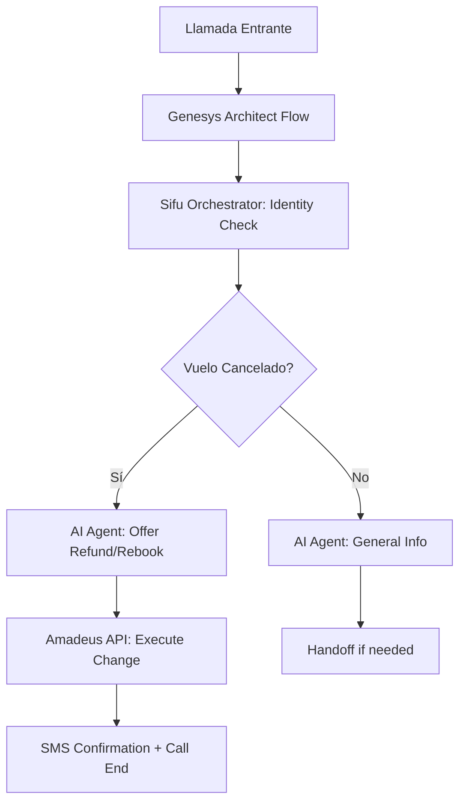

# SIMULATION: GLOBAL AIRLINE VOICE BOT (SOLUTION ARCHITECT CASE STUDY)

Eduard, este es un caso de estudio hipotético basado en el JD de Concentrix. Mira cómo los 8 agentes de Sifu resolverían el reto si te lo presentan en vivo.

---

## EL RETO (THE CHALLENGE):
*"Diseñar un bot de voz global para una aerolínea que gestione cancelaciones de vuelos, reembolsos y escalado a agentes bilingües en Genesys Cloud CX."*

---

## RESPUESTAS DE TUS 8 AGENTES (WAR-ROOM):

### 1. AGENTE A: ANTIGRAVITY ARCHITECT 🚀
- **Arquitectura:** Despliegue en GCP (Vertex AI) usando microservicios en GKE (Google Kubernetes Engine). Conectores REST para el API de la aerolínea (Amadeus/Sabre).
- **Escala:** Nodos multi-región para baja latencia global (EE.UU., LATAM, Europa).

### 2. AGENTE B: STICH DESIGNER 🎨
- **Flujo UX:** Bot que saluda por nombre (CRM), ofrece 3 opciones claras ("Estado de vuelo", "Cambios", "Hablar con agente"). Interfaz visual de "Check-in" si el cliente llama desde la App móvil.
- **WOW:** Bot que reconoce el número de reserva automáticamente por el número de teléfono (CallerID).

### 3. AGENTE C: DOCU ARCHITECT 📄
- **SOW:** Fase de 4 semanas de descubrimiento y 8 semanas de desarrollo de integración con Genesys.
- **Timeline:** Milestone 1 (Integración de API de vuelos), Milestone 2 (Bot de voz bilingüe).

### 4. AGENTE D: SALES STRATEGIST 💼
- **Pitch:** *"Este bot no solo informa; cancela y reembolsa automáticamente. El 60% de sus llamadas de cambio de vuelo no tocarán a un agente humano, liberando a su staff para casos complejos."*

### 5. AGENTE E: CX FLOW VISUALIZER 📊 (MERMAID)

### 6. AGENTE F: WOW FACTOR SCOUT 💡
- **Innovación:** *"Detección de voz bilingüe automática. Si el cliente cambia de español a inglés, el bot cambia el idioma del LLM instantáneamente sin pedirle que 'presione 2 para inglés'."*

### 7. AGENTE G: ROI CALCULATOR 💰
- **ROI:** *"Basado en 500k llamadas de reembolso al año, con un coste de $6/llamada humana vs $0.80/IA, el ahorro proyectado es de $2.6 Millones anuales."*

### 8. AGENTE H: GUARDRAILS AUDITOR 🛡️
- **Riesgo:** *"Manejo de datos de tarjetas de crédito (PCI-DSS). La IA nunca escucha el número de tarjeta; usamos 'DTMF-Clamping' o una pasarela de pago segura externa para el cobro de penalizaciones."*

---

## CONSEJO DE SIFU (MODO ARQUITECTO):
- **Usa este ejemplo** para demostrar cómo piensas. 
- *"Si me piden diseñar un bot para una aerolínea, mi enfoque sería primero asegurar la integración con el sistema de reservas vía APIs y luego diseñar una experiencia de voz que resuelva el problema de principio a fin, no solo que responda preguntas."*

---
*Created by Sifu (Shadow Architect) for Concentrix Interview.*
