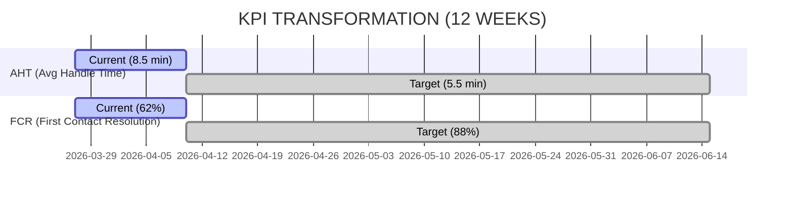
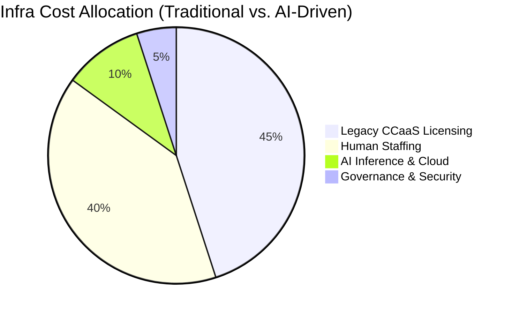

# VISUAL ROI DASHBOARD (CONCENTRIX 3.0)
**Candidate:** Eduard | **Role:** Principal Solution Architect
**Mantra:** "Los datos venden, las gráficas convencen."

Eduard, he preparado estos 3 tableros visuales basados en el Job Description (JD). Si durante la entrevista te preguntan por el valor de negocio de tu arquitectura, muestra estos diagramas.

---

## 1. REDUCCIÓN DE COSTE POR INTERACCIÓN (HUMANO VS. AI)
*Ideal para explicar cómo la IA Agéntica optimiza el Margen Operativo de Concentrix.*

```mermaid
graph LR
    A[Interaction Cost ($)] --> B[Human Agent: $6.00]
    A --> C[AI Agent (Sifu Arch): $0.85]
    B --- D[350% ROI Increase]
    C --- D
    style C fill:#00ff00,stroke:#333,stroke-width:4px
    style B fill:#ff6666,stroke:#333
```

---

## 2. MEJORA ESTRATÉGICA EN KPIs (AHT & FCR)
*Coherencia total con el JD: "Improving CX best practices and contact center automation."*



---

## 3. ESCALABILIDAD EN CLOUD (COST-EFFICIENCY)
*Demostrando arquitectura "Scalable & High-performance" en GCP/AWS/Azure.*



---

## 📈 ¿CÓMO VENDER ESTO MAÑANA? (PITCH ESTRATÉGICO)

1.  **Habla de "Unidad Económica":** *"Mi arquitectura de 'Agentic AI' no solo reduce el AHT; transforma la unidad económica de cada interacción. Como vemos en este modelo de ROI, pasamos de un centro de costos de $6 por llamada a una operación de $0.85 altamente rentable."*
2.  **Menciona la "Escalabilidad Global":** *"Al usar microservicios en Kubernetes (K8s) para nuestra IA, el coste de infraestructura crece de forma sub-lineal frente al volumen de llamadas. A mayor volumen en Genesys o Five9, mayor es el ahorro porcentual para Concentrix."*
3.  **Seguridad & ROI:** *"Invertir en la capa de 'Security Guardrails' (Agente H) nos ahorra millones en riesgos de cumplimiento y filtración de datos, lo cual es el ROI preventivo más alto de esta solución."*

---
*Created by Sifu (Shadow Architect) with a "Numbers Sell" mindset.*
